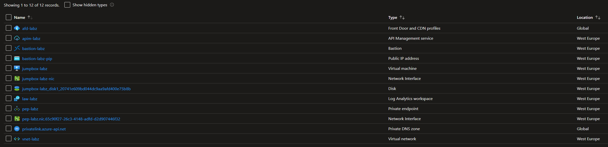
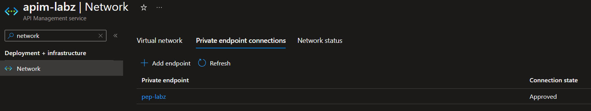
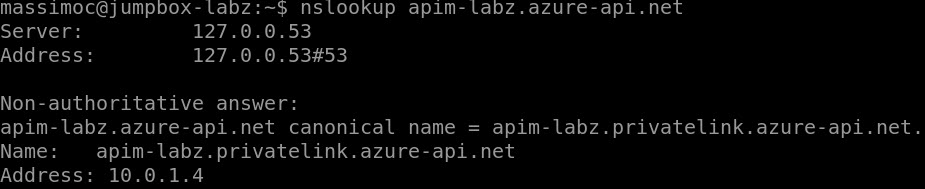
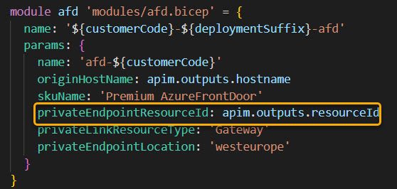
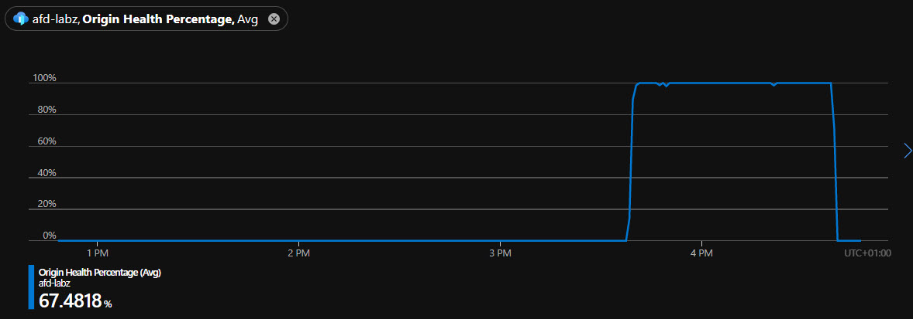
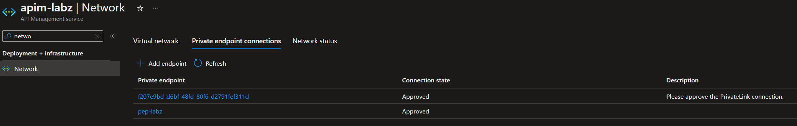
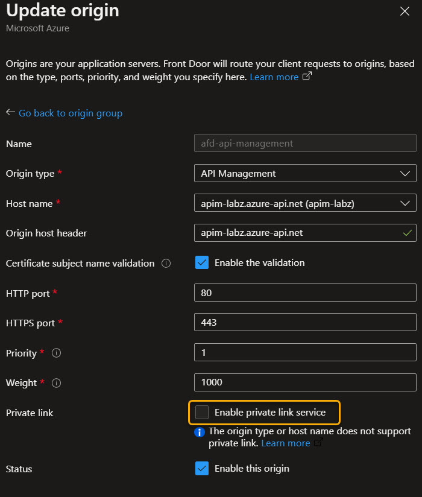
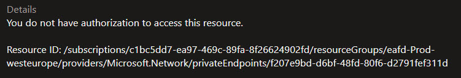
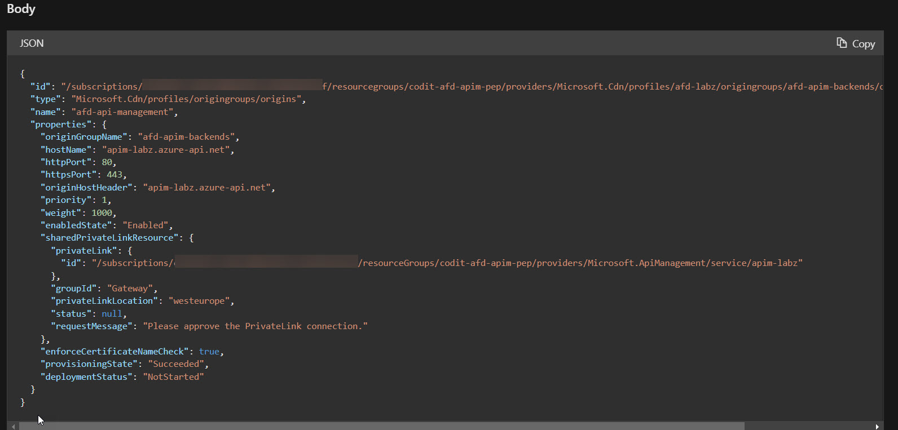

# Scenario

Simple lab to secure the APIM origin with Private Link in Front Door Premium

**Outcomes** : 
- Origin support for direct private endpoint connectivity is currently limited to Storage (Blob), App Services and ILB; meaning that you cannot use a private endpoint previously created for APIM. 
- When AFD is instructed to use a private endpoint to communicate to APIM, a new private endpoint will be created in a microsoft-managed subscription. 
- Enabling VirtualNetwork type: External or Internal is not supported for APIM services which have Private Endpoint Connections.

**Resources** : 
- https://learn.microsoft.com/en-us/azure/frontdoor/private-link
- https://learn.microsoft.com/en-us/azure/api-management/private-endpoint

# Deployment

Overview of the Azure resources deployed



## LAB1

In the LAB1 we do **NOT** link AFD origin to the APIM private link

```
az account set --subscription c1537527-abcd-abcd-abcd-abcdabcdabcd

az deployment  group create --resource-group codit-afd-apim-pep --template-file lab1.bicep
```

The private endpoint is configured for APIM together with the "privatelink.azure-api.net" private DNS zone.



From the jumpbox you can get the APIM gateway IP over the private link.



The AFD probe is working as expected and we can reach the APIM public endpoint via AFD.

```
# probe endpoint return 200
curl -v https://apim-labz.azure-api.net/status-0123456789abcdef

# apim public endpoint return 200
curl -v "https://apim-labz.azure-api.net/echo/resource?param1=sample&subscription-key=e3a02410591b45988bf4089fa1f23bc7"

# afd public endpoint return 200
curl -v "https://afd-labz.z01.azurefd.net/echo/resource?param1=sample&subscription-key=e3a02410591b45988bf4089fa1f23bc7"

```


## LAB2

With the LAB2 :
- we connect AFD to APIM via private endpoint (new private endpoint created by AFD)
- the APIM public network access of APIM is disabled.



```
az deployment  group create --resource-group codit-afd-apim-pep --template-file lab2.bicep
```

As result of the deployment the AFD probe is not healthy anymore. 



Once approved the private endpoint, the AFD probe is back to healty.



💡 Note:  that Azure Portal do not allow to enable the private link for API Management.



💡 Note : the private endpoint created by AFD is created in an unknown-microsoft-managed subscription.



Get the origin details via REST API : https://learn.microsoft.com/en-us/rest/api/frontdoor/azurefrontdoorstandardpremium/afd-origins/get



```
# probe endpoint return 403
curl -v https://apim-labz.azure-api.net/status-0123456789abcdef

# apim public endpoint return 403
curl -v "https://apim-labz.azure-api.net/echo/resource?param1=sample&subscription-key=e3a02410591b45988bf4089fa1f23bc7"

# afd public endpoint return 200
curl -v "https://afd-labz.z01.azurefd.net/echo/resource?param1=sample&subscription-key=e3a02410591b45988bf4089fa1f23bc7"

```

## LAB3

The goal of the lab3 is to update the APIM network configuration to External to validate whether the change will broke the private endpoint configuration.

```
az deployment  group create --resource-group codit-afd-apim-pep --template-file lab3.bicep
```

the deployment fails with the following error : *Enabling VirtualNetwork type: External is not supported for service which has Private Endpoint Connections.*